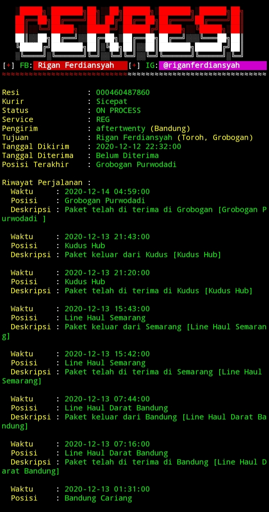

# cek-resi




## Instalasi Termux
```
pkg update && pkg upgrade
apt-get install python3
pip3 install requests
git clone https://github.com/rigan256/cek-resi.git
cd cek-resi
python3 resi.py
```

## Instalasi Linux
```
apt-get install python3 python3-pip
pip3 install requests
git clone https://github.com/rigan256/cek-resi.git
cd cek-resi
python3 resi.py
```
